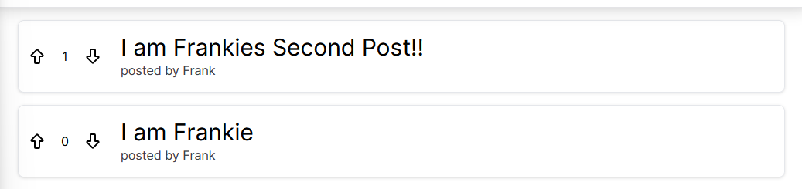

# Week Eleven Project _(Kind of!)_

## Upvote - A reddit clone _(which we needed to fix)_

**Link to project:** [Link](https://frankies-forkit.vercel.app/)

**Please scroll down to "Frankies Fixes and Trail of Test" for my edits and methods**

---

Upvote is a Reddit-esque web application that allows users to create posts, upvote and downvote posts, and comment on posts in a multi-threaded, nested list.

The project is built using Next.js with the /app router and [Tailwind CSS](https://tailwindcss.com/), and uses [Auth.js (formerly Next Auth)](https://authjs.dev/) for user authentication. The data is stored in a Postgres database, which is created and accessed with raw SQL queries using the `pg` package.

The project is a work in progress and is not yet complete.

## Features

- [x] View a list of posts
- [x] View a single post
- [x] Create a post
- [x] Upvote and downvote posts
- [x] Pagination of posts
- [x] Comment on posts
- [x] Nested comments (recursive lists)
- [x] User authentication

## Setup instructions

1. Fork the repository (check "copy the main branch only") and clone your fork to your local machine
2. Run `npm install`
3. Create a `.env.local` file in the root directory and add the following environment variables:
   - `DATABASE_URL` - the URL of your Postgres database (eg. the Supabase connection string)
   - `AUTH_SECRET` - the Next Auth secret string (this can be anything at all like a password, but keep it secret!)
   - `AUTH_GITHUB_ID` - the GitHub OAuth client ID (create yours in [Github developer settings](https://github.com/settings/developers)
   - `AUTH_GITHUB_SECRET` - the GitHub OAuth client secret (create this in [Github developer settings](https://github.com/settings/developers))
4. Create the database schema by running the SQL commands in `schema.sql` in your database (eg. by running the commands in Supabase Query Editor)
5. Run `npm run dev` to start the development server
6. Open [http://localhost:3000](http://localhost:3000) with your browser to see the site

## Potential future features

- [ ] User profiles
- [ ] Sorting posts by recent (date posted), top (most upvotes), and most controversial (most upvotes _and_ downvotes)
- [ ] User karma scores
- [ ] User badges / trophies (awards for achievements like number of posts, years on the site, etc.)
- [ ] User settings (eg. number of posts per page, theme, etc.)
- [ ] Moderation tools / reporting or flagging objectionable comments for removable by admins
- [ ] Searching posts (possibly using simple SQL LIKE '%some search%', or [Postgres text search](https://www.crunchydata.com/blog/postgres-full-text-search-a-search-engine-in-a-database))
- [ ] Subreddits (separate communities, that isn't just one big list of posts, that can be created by users)
- [ ] User notifications
- [ ] User private messaging
- [ ] User blocking
- [ ] User following
- [ ] User feed (posts from users you follow)
- [ ] User flair

# Frankies Fixes and Trail of Test

The point of this project was that [the initial version we cloned was broken in a few places](https://github.com/shaunchurch/didit-reddit-upvote-example) and needed testing, fixing and once "working", some stretch goals implemented.

## Setup

- First, after making a fork and getting everything cloned down, I setup the .env.local. This process was simple enough to do by following the video guide by the Senior Dev. I also used `npx auth secret` to generate a secret for the `AUTH_SECRET` variable.

- I set up a database on Supabase, copied the connection string over and then tested the code on my localhost.

## Vercel

- Deploying to Vercel was the next step. The deployment ran with zero errors 👀 (but one warning recommending against using img tags)

- The first bug was trying to log in to the deployed site. The issue was when you clicked "Log in" you were shown a 404 page. However, when you refreshed, the button to "Log In" to your GitHub account would show.

I spent a good couple of hours chasing leads on this bug trying to fix it. Quite a lot of [unfruitful](https://github.com/nextauthjs/next-auth/issues/10585) [Google](https://github.com/nextauthjs/next-auth/issues/6981) [searches](https://stackoverflow.com/questions/67715077/next-auth-receiving-404-after-login-attempt-in-deployed-vercel-application) occured, which showed other people having the same issues.

To get to a solution, I stepped through the [Auth.js docs](https://authjs.dev), ensured my local files matched the guidance in the docs, and then tried changing my Login Button to a Client Component, from a Server Component:

```javascript
"use client";

import { signIn } from "next-auth/react";

export function LoginButton() {
  return <button onClick={() => signIn()}>Sign In</button>;
}
```
This sorted out the error!

## Playtimes

After basic deployment to Vercel, it was time to play around with the project and fix up a few things here and there.

- First thing was to make a distinction between posts on the home page. Nothing major, just a little bit of UI niceness:




- I then made an error page which displayed if a user tries to vote on a post without being logged in:


This wasn't as straightforwards as throwing an error and using a global error page, as when deployed on Vercel Next.js didn't allow server-side error messages to be rendered to the user.

I got around this by simply redirecting to a custom error page instead.

- I created a loading page with a [LDRS](https://uiball.com/ldrs/) spinner to give the user some feedback that things were happening in the background. However, there was trouble at Build time and there were errors in rendering the loaders so I took them out for now! But the loading page displays.

- I added dynamic metadata to the individual posts pages, so that the post title displayed in the browser tab.
